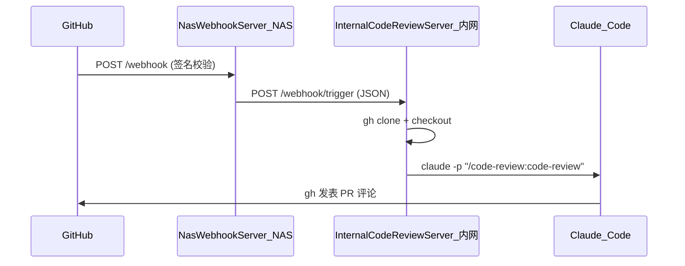

# nas-local-claudecode-codereview

GitHub Webhook → NAS 中继 → 内网服务：在 **pull_request** 时自动用 **Claude Code** 做 PR 代码审核。

## 架构



- **NasWebhookServer**：部署在 NAS（公网可达），接收 GitHub Webhook，校验签名后 HTTP 转发到内网。
- **InternalCodeReviewServer**：部署在内网，收到 `pull_request` 后克隆仓库，在 Claude Code 终端执行 `/code-review:code-review`，由 Claude Code 完成审核并发表评论。

## 目录结构

```
nas-local-claudecode-codereview/
├── NasWebhookServer/          # GitHub Webhook 中继（NAS 上跑）
│   ├── main.py
│   ├── github.py
│   ├── internal.py
│   ├── Dockerfile
│   ├── docker-compose.yml
│   ├── test_webhook.py        # 本地测试脚本
│   └── README.md
├── InternalCodeReviewServer/  # 内网 Code Review 服务
│   ├── main.py
│   ├── review_runner.py
│   └── README.md
├── LICENSE
└── README.md
```

## 快速开始

### 1. NasWebhookServer（NAS / 公网）

在 NAS 或公网可访问的机器上运行，对外提供 Webhook URL（如 `https://your-nas.com/webhook`）。

```bash
cd NasWebhookServer
cp .env.example .env
# 编辑 .env：GITHUB_WEBHOOK_SECRET、INTERNAL_TARGET_URL（内网服务地址）
pip install -r requirements.txt
uvicorn main:app --host 0.0.0.0 --port 8000
```

或使用 Docker：见 [NasWebhookServer/README.md](NasWebhookServer/README.md)。

**GitHub 配置**：仓库 → Settings → Webhooks → Payload URL 填 `https://你的域名/webhook`，Secret 与 `.env` 中一致。

### 2. InternalCodeReviewServer（内网）

在内网一台已安装 **Claude Code CLI**、**gh** 的机器上运行。

```bash
cd InternalCodeReviewServer
cp .env.example .env
# 编辑 .env：GH_TOKEN（必填）
pip install -r requirements.txt
uvicorn main:app --host 0.0.0.0 --port 8009
```

NasWebhookServer 的 `INTERNAL_TARGET_URL` 填本机地址，如 `http://192.168.1.100:8009`。

### 3. 测试 Webhook

```bash
cd NasWebhookServer
python test_webhook.py --secret "你的GITHUB_WEBHOOK_SECRET" --url https://你的webhook地址/webhook
```

## 文档

- [NasWebhookServer](NasWebhookServer/README.md)：环境变量、Docker、发布镜像、内网 API 约定
- [InternalCodeReviewServer](InternalCodeReviewServer/README.md)：Claude Code 前置条件、环境变量、对接说明

## License

MIT
